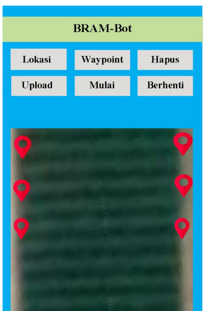

# 🤖🚤 Autonomous Floating Robot (Robot Apung) with GPS & Compass Navigation

This project implements an **autonomous floating robot** that navigates water surfaces based on **GPS waypoint tracking** and **compass orientation**. It uses a combination of sensors (GPS, HMC5883L magnetometer, ultrasonic SR04), motor driver logic, and telemetry communication to track location, avoid obstacles, and reach defined waypoints.

---

## 📁 Project Structure

```

.
├── hardware/                        # PCB layout and electronic schematics
│   ├── sch.pdf, sch.png             # Schematic of the robot
│   ├── pcb-top.pdf, pcb-bot.pdf     # Top and bottom PCB layers
│   └── pcb-2d.PNG, pcb-3d.PNG       # PCB render previews
├── image/                           # Images of the robot and Android app
│   ├── android.jpg
│   ├── android-scene.jpg
│   └── icon.jpg
├── software/
│   ├── android/                     # Android App (MIT App Inventor AIA/APK)
│   │   └── robotApung_com_fix2.apk / .aia
│   ├── arduino/                     # Arduino source code and tests
│   │   ├── main.ino                 # Entry point for testing GPS and motion
│   │   ├── robot-apung/             # Modular components for navigation
│   │   │   ├── robot-apung.ino      # Main autonomous logic
│   │   │   ├── compass.ino, gps.ino, motor.ino, etc.
│   │   ├── test-*.ino               # Unit tests for sensors & motor
│   ├── telemetry/                   # Ground telemetry module files
│   │   ├── setting.png, 3DR.zip
│   └── sql.txt                      # Sample SQL for telemetry database
├── LICENSE
└── README.md

```

---

## 🛠️ Hardware Components

- Arduino Mega 2560
- GPS Module (Ublox Neo-6M)
- HMC5883L Compass
- 3x HC-SR04 Ultrasonic Sensors (Front, Left, Right)
- Motor Driver Module (2 channel per side)
- Telemetry Radio Module (e.g., 3DR/HC-12)
- SD card (for data logging, optional)
- Android device (for waypoint input and monitoring)
- Custom PCB (see hardware folder)

---

## 🔧 Arduino System Overview

### Navigation Sensors
- **GPS** → to get latitude/longitude.
- **Compass (HMC5883L)** → to get heading direction.
- **Ultrasonic Sensors** → for obstacle avoidance.

### Motion System
- 2 pairs of motors (D1 & D2) configured for bidirectional control.
- PWM-controlled via `analogWrite`.

### Waypoint Mode
- Receives waypoints via **telemetry**.
- Calculates heading and distance to next waypoint.
- Adjusts motion and direction accordingly.

---

## 📲 Android App Control

- Built using MIT App Inventor.
- Features:
  - Send and clear waypoints.
  - Start navigation (`Go` command).
  - Monitor telemetry (GPS, heading, distance).
- Files:
  - `robotApung_com_fix2.aia` (source)
  - `robotApung_com_fix2.apk` (installer)




---

## 📡 Telemetry Integration

- Communicates via `Serial1` (9600 baud) to ground telemetry module.
- Sends:
  - GPS coordinates
  - Sensor readings
  - Status updates
- Receives:
  - Control commands (`addWP`, `goWP`, etc.)

---

## 📍 Waypoint Commands (via Telemetry)

| Command | Description                |
|---------|----------------------------|
| `a`     | Add waypoint (followed by data) |
| `b`     | Delete last waypoint       |
| `c`     | Check current waypoints    |
| `d`     | Clear all waypoints        |
| `e`     | Start autonomous navigation |

---

## 🚦 Sensor Testing & Diagnostics

Use `main.ino` for offline testing:
- `test_jalan()` → motor movement tests.
- `test_sensor()` → measure all SR04 distances.
- GPS & telemetry test with serial logs.

---

## 💡 How to Run

1. **Flash firmware** from `software/arduino/main.ino` or `robot-apung.ino`.
2. **Connect sensors** as per `hardware/sch.pdf`.
3. **Install APK** to Android phone and connect telemetry.
4. Use app to send waypoints and start robot navigation.

---

## 📷 Visuals

### Schematic and PCB


---

## 🧪 Library Dependencies

- [TinyGPSPlus](https://github.com/mikalhart/TinyGPSPlus)
- [HMC5883L](https://github.com/jarzebski/Arduino-HMC5883L)
- [Timer](https://github.com/JChristensen/Timer)
- Others: Wire, SoftwareSerial (Arduino built-ins)

Import the `.zip` libraries from `software/arduino/libraries/`.

---

## 🗃️ Optional Database Support

The `sql.txt` file includes an SQL schema to log:
- Timestamp
- GPS location
- Heading
- Distance to waypoint
- Robot status

This can be used for offline or web dashboard analysis.

---

## 📜 License

Distributed under the MIT License. See `LICENSE` for more information.

---

## 👨‍🔧 Author

Developed by **Ardy Seto Priambodo**  
Email: [2black0@gmail.com](mailto:2black0@gmail.com)

---

> 💬 *"Navigating water with intelligence – one waypoint at a time."*